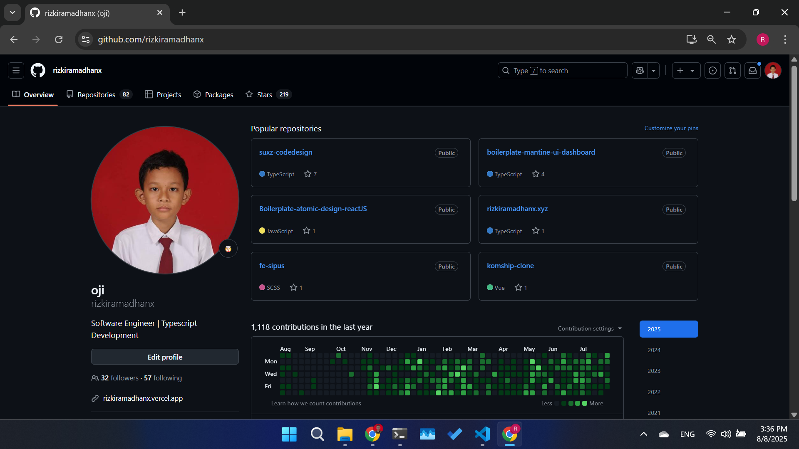

<h1 align="center">Hi 👋, I'm Rizki Ramadhan</h1>

<h3 align="center">A passionate Frontend Developer from Indonesia 🇮🇩</h3>

  
  
  

---

### 🚀 About Me

- 💻 I love crafting clean and interactive UIs using **React & Tailwind CSS**
- 🌱 Currently learning **Next.js**, **TypeScript**, and exploring full-stack development
- 📫 Reach me at: **rizkiramdhanx@gmail.com**
- 🌐 All of my projects are available at [**rizkiramadhanx.dev**](https://rizkiramadhanx.vercel.app/)

---

### 🛠️ Tech Stack

  
  
  
  
  

---

## 🛑 I Lost My Previous GitHub Account

**📅 Date:** August 8th, 2025  
**📂 Reason:** I lost access to my previous GitHub account and was unable to recover it.

I’ve decided to start fresh with this new account and will continue sharing, contributing, and maintaining my work here.

If you previously collaborated with me under another username or are trying to find my older repositories, feel free to reach out:

- 📩 Email: [rizkiramdhanx@gmail.com](mailto:rizkiramdhanx@gmail.com)
- 💼 Link

### 🔒 Screenshot Proof

> _Screenshot taken as proof on August 8, 2025._

---
